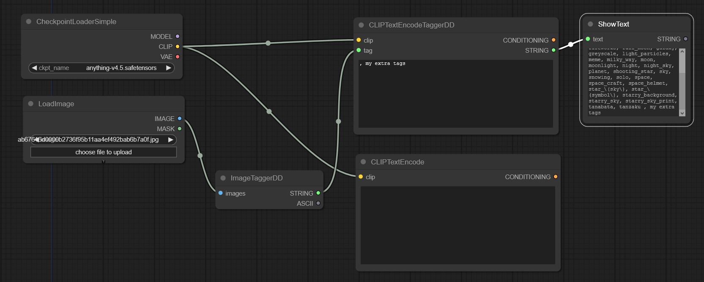

# ComfyUI_tagger

1. Clone repository to `ComfyUI\custom_nodes\ComfyUI_tagger`
2. Set the deepbooru model path at `ComfyUI_tagger\modules\deepbooru.json`

> i.e.
> ```json
> "DeepDanbooru": "e:/.../torch_deepdanbooru/model-resnet_custom_v3.pt"
> ```

3. Use use node `DD > ImageTaggerDD` to generate tags
4. (optional) Use `ShowText` from https://github.com/pythongosssss/ComfyUI-Custom-Scripts/tree/main/show-text for feedback/debug

